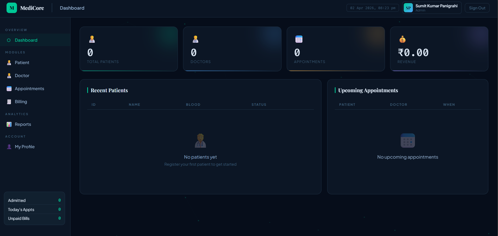

🏥 MediCore — Hospital Management System
📌 Description
MediCore is a modern hospital management system designed to streamline healthcare operations. It helps manage patient records, doctor appointments, billing, and administrative tasks efficiently through a clean and user-friendly interface.

🚀 Features
👨‍⚕️ Patient Management
📅 Appointment Scheduling
💳 Billing System
📊 Dashboard Overview
🔐 User Authentication UI
📱 Responsive Design

## 🛠️ Tech Stack
 🌐 HTML  
 🎨 CSS  
 ⚡ JavaScript  

## 📸 Screenshots
### 👤 Add Patient

### 👨‍⚕️ Add Doctor

### 🆕 Create Account

### 📊 Dashboard

### 🔐 Login

### 🙍‍♂️ My Profile

### 🏥 Patient Management

⚙️ Installation
git clone https://github.com/your-username/MediCore-Hospital-Management-System.git
cd MediCore-Hospital-Management-System

▶️ Usage
Open index.html in your browser
Explore the UI and features

MediCore/
│── index.html
│── style.css
│── app.js
│── screenshots/

📜 License
This project is open-source and available under the MIT License.

👨‍💻 Author
Sumit Kumar Panigrahi

⭐ Support
If you like this project, give it a ⭐ on GitHub!
